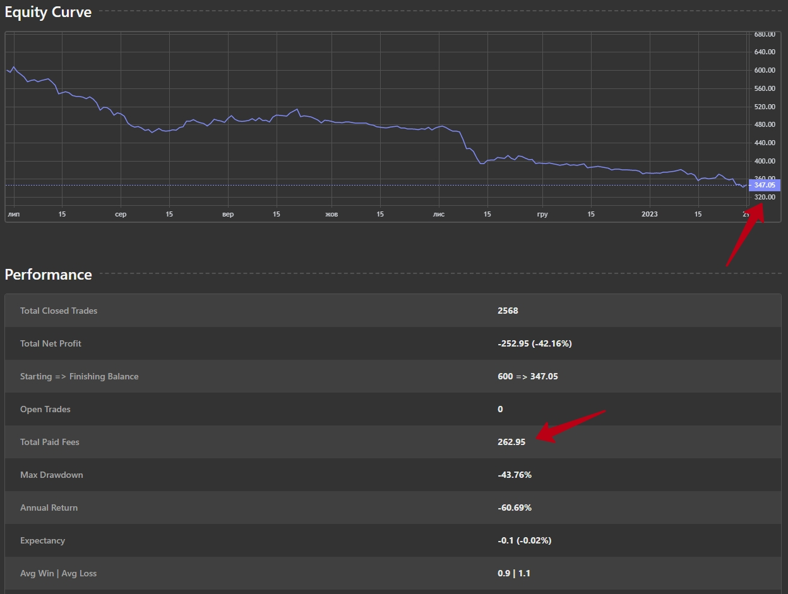

# Стратегія VWMA + RSI

Короче класика:
фільтр тренду - три ЕМА
decision maker - RSI

проблема як завжди:
- якщо мало трейдів, то мала вибірка і форвард тест провалюється
- якщо багато трейдів, то комісія все від'їдає

Тести проводились на Н1, М15, М15, М1

В найкращому випадку це 0 з комісією.

Форвард при цьому провалюється.

Результат 12 інструментів на М5:

При параметрах

    # MA1
    self.vars["ma1"] = 60
    # MA2
    self.vars["ma2"] = 150
    # MA3
    self.vars["ma3"] = 180

    # Risk/Reward
    self.vars["RR"] = 1
    # RSI period
    self.vars["rsi"] = 5
    # MIN border RSI
    self.vars["lower_rsi"] = 30
    # MAX border RSI
    self.vars["upper_rsi"] = 70

    # Last bar range
    self.vars["vol_filter"] = 0.7
    # ATR multiplier
    self.vars["atr_multiplyer"] = 2

    # Start balance
    self.vars["start_bal"] = 100

    # reverse? 1=no, 2=yes
    self.vars["REVERSE"] = 1